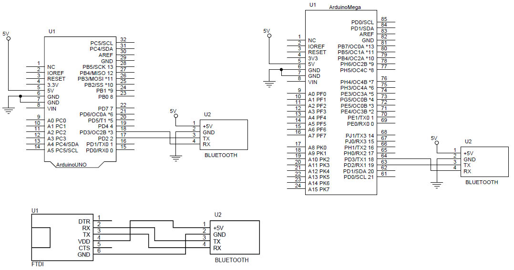
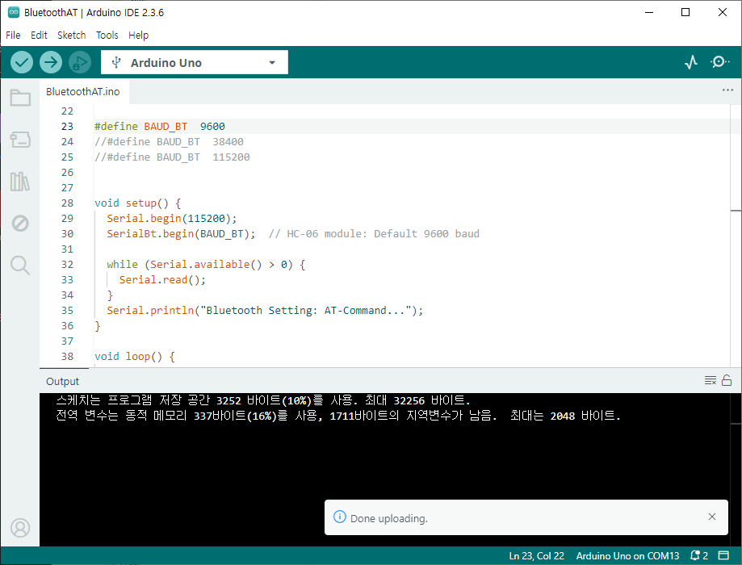
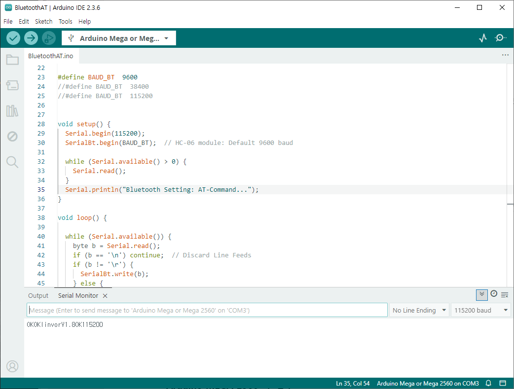
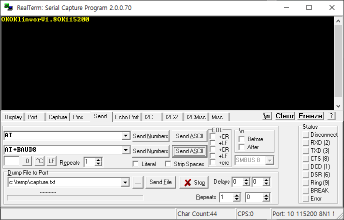
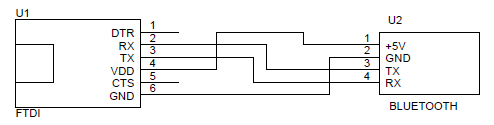
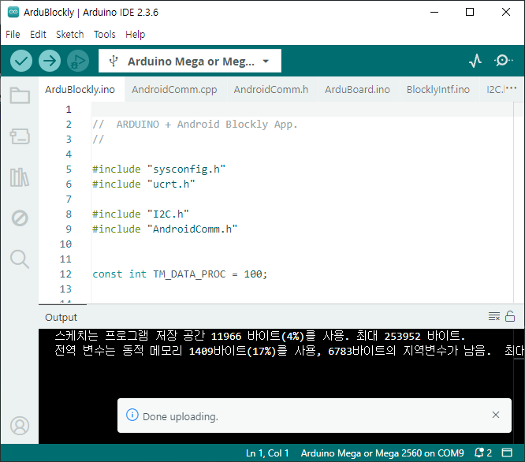
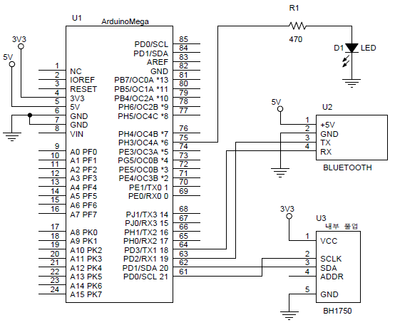

# 아두이노 설치 파일 및 참고 자료

앱과 아두이노는 연동하여 동작하기 때문에 양쪽에 코딩이 필요하고, 하드웨어에서는 동작 환경을 만들어야 한다.

전체 과정은 'documents' 폴더의 '따라하기 Blockly+Arduino앱.pdf' 설명서를 참고하여 흐름을 이해하면 된다.

이 폴더는 앱 실행 전, 아두이노 실행 준비과정이다. 

- 블루투스 설정 - 통신속도 설정
블루투스의 통신 속도는 제품에 따라 다르므로 제조사의 사용설명서를 참고하여 속도를 확인하고 아두이노의 시리얼 포트의 속도와 맟춘다.

- 아두이노 실행 C++ 코드 업로드
폴더: ArduBlockly - 아두이노 하드웨어 보드에 'Arduino IDE'을 통해 업로드하여 아두이노가 동작하도록 준비하기 위한 코드이다.

## 아두이노 회로 연결

'schematic'폴더의 'ArduBlocklyExample.pdf'는 다음 2가지의 회로를 포함하고 있다.

# 블루투스 모듈 설정 (속도 맞추기)

아두이노나 FTDI(윈도우에서 USB-시리얼 변환)를 사용하여 블루투스 AT-COMMAND를 실행할 수 있는 환경이 필요하다.
AT-COMMAND를 통해 블루투스 모듈의 다양한 설정을 할 수 있다.

이 환경을 구축하기 위해:
1. 블루투스 연결 하드웨어 회로에 따라 연결하여 준비한다.
2. AT-COMMAND 명령으로 원하는 환경을 설정한다.

회로 연결:

그림에서 아두이노 UNO와 MEGA 2560을 사용하여 윈도우 터미널에서 명령을 블루투스에 전달하는 역활을 하도록 연결한다.
아래 그림은 FTDI 모듈을 통해 윈도우와 블루투스 간의 명령 전달 역활을 한다.

## 아두이노를 활용한 블루투스 설정

AT-COMMAND 명령을 윈도우에서 블루투스로 전달하기 위한 다리 역활을 아두이노가 한다. 
단순히 윈도우쪽과 블루투스의 명령 ASCII 코드의 문자 코드를 전달하는 역활을 한다.

### 아두이노 UNO 사용

아두이노 UNO의 MCU(ATmega328P)는 UART 시리얼 모듈이 한개 밖에 없다. 
따라서 중계를 하려면 2개의 시리얼 포트가 필요하므로 하드웨어 회로없이 소프트웨어 방식으로 시리얼 지원하는 방식으로 코딩 하였다.
아두이노 mega2560는 시리얼 포트가 4개 이므로 Serial, Serial1을 사용하도록 코딩하였다.

아두이노 소스:
  arduino/bluetooth/BluetoothAT/BluetoothAT.ino
사용하여 중계 역활을 한다.

이 코드는 블루투스 처음 한번 블루투스를 설정하기 위한 도구 이므로 안드로이드 앱 실행 전에 설정하는 것이다.

AT-Command 명령을 수행 전에 이 코드를 아두이노에 업로드 한다.

<pre>
HC-06 예

---------------+---------------------
 명령        &#09;결과
---------------+---------------------
 AT          	&#09;OK
 AT+VERSION   &#09;OKlinvorV1.8
 AT+BAUD8     &#09;OK115200
 AT+BAUD4     &#09;OK9600
 AT+PIN1234   &#09;OKsetPIN
 AT+NAMEHC-06 &#09;OKsetname
---------------+---------------------
</pre>

### FTDI를 활용한 블루투스 설정

FTDI는 아두이노 없이 USB-시리얼 변환을 해 준다. 따라서 쉽게 연결이 가능하고 적당한 윈도우용 터미널 앱만 있으면 된다.

# 아두이노 실행 파일 업로드 

안드로이드 앱이 시작되기 전에 아두이노 UNO/MEGA 보드에 안드로이드 앱과 연동하여 하드웨어를 제어하는 코드를 업로드 해야한다.
안드로이드 앱에서 블록코드가 실행되면 블록에 따라 하드웨어의 상태를 읽거나 데이터를 써야 한다.

아두이노 실행을 위한 C++ 코드: arduino/ArduBlockly/*: 아두이노  파일.
이 코드는 블루투스를 통해 앱과 연동하여 아두이노의 하드웨어의 제어하는 구조이므로 이 코드는 전체 블록 실행 전에 아두이노에 업로드 한다.

아두이노 업로드는 'Arduino IDE'을 활용하여 업로드 한다. 

# 하드웨어 회로도

'sschematic' 폴더의 하드웨어 회로도는 블루투스 설정용 회로와 사용설명서 예제 블록 코드에 대응하는 예제 회로도이다.

## 사용 설명서에서 사용한 예제 블록코드를 실행하기 위한 아두이노 회로도 

사용 설명서에 예제 블록코드를 실행하기 위한 회로도 이다. 

'Blockly+Arduino 블럭 코드 사용설명서.pdf' 문서에 제시한 예제 블록코드를 실행하기 위한 아두이노 회로도 예이다.

* 사용설명서에 언급한 예제를 위한 아두이노와 부품의 연결 회로도 예:

