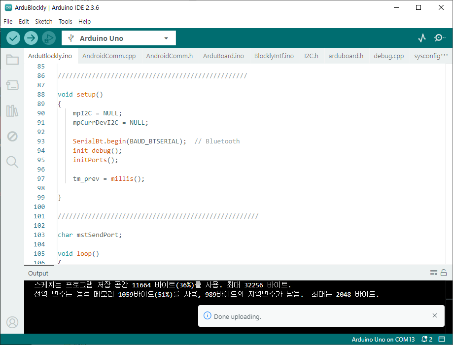

# 아두이노 설치 파일 및 참고 자료

- 아두이노 실행 C++ 코드

폴더: ArduBlockly

아두이노 하드웨어 보드에 'Arduino IDE'을 통해 업로드하여 아두이노가 동작하도록 준비하기 위한 코드이다.
'documents' 폴더의 '따라하기 Blockly+Arduino앱.pdf' 설명서를 참고하여 파일을 사용한다.

- 블루투스 설정 - 통신속도 설정

블루투스의 통신 속도는 제품에 따라 다르므로 제조사의 사용설명서를 참고하여 속도를 확인하고 아두이노의 시리얼 포트의 속도와 맟춘다.

아두이노를 사용한 경우:

- 아두이노 회로 연결

'schematic'폴더의 'ArduBlocklyExample.pdf'는 다음 2가지의 회로를 포함하고 있다.

* 블루투스 설정에 필요한 회로도

블루투스 설정을 위한 회로도로 앱을 동작하기 전에 블루투스를 설정하기 위한 회로도이다.

* 사용설명서에 언급한 예제를 위한 아두이노와 부품의 연결 회로도 

각 예제에 따른 회로로 이다.

## 아두이노 실행 파일 업로드 

- 아두이노 실행을 위한 C++ 코드: arduino/ArduBlockly/*: 아두이노  파일.

아두이노 UNO/MEGA 보드에 Upload하고 블루투스를 연결하여 안드로이드 앱과 연동할 수 있는 준비를 하고 앱을 실행한다.

아두이노 업로드는 'Arduino IDE'을 활용하여 업로드 한다. 

## 블루투스 모듈 설정 

- 아두이노 또는 FTDI을 활용하여 블루투스 모듈의 속도 등의 원하는 설정을 한다.

  arduino/bluetooth/BluetoothAT/BluetoothAT.ino

  이 코드는 윈도우와 블루투스 간의 AT-Command을 전달하기 위해 아두이노를 브릿지로 사용하기 위한 코드이다.
  따라서 이 코드를 블루투스 설정을 위해 사용한다. 

## 아두이노 관련 연결 회로도

다음 2가지를 실행하기 위한 회로도를 참고할 수 있다.

### 아두이노 또는 FTDI를 활용한 블루투스 설정
블루투스 설정을 의해 준비해야 할 회로도이다. 

### 사용 설명서에서 사용한 예제 블록코드를 실행하기 위한 아두이노 회로도 

사용 설명서에 예제 블록코드를 실행하기 위한 회로도 이다. 

'Blockly+Arduino 블럭 코드 사용설명서.pdf' 문서에 제시한 예제 블록코드를 실행하기 위한 아두이노 회로도 예이다.

