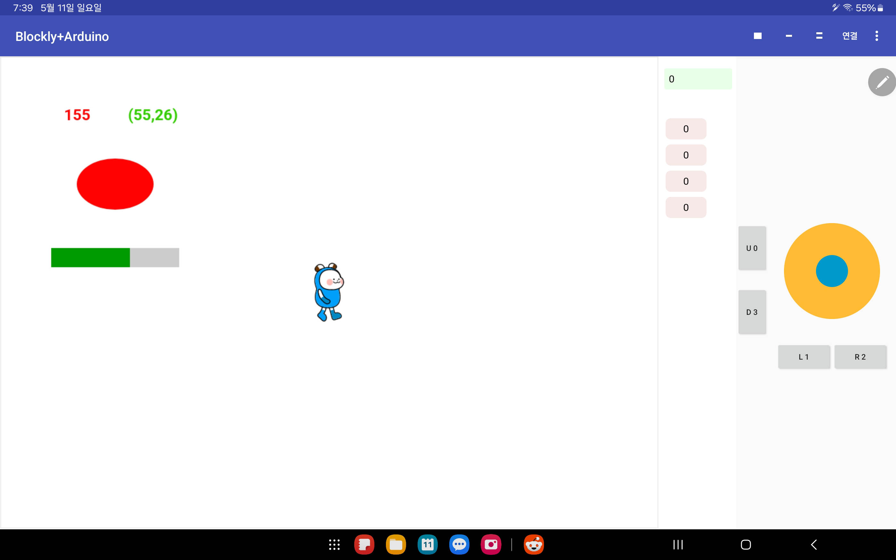
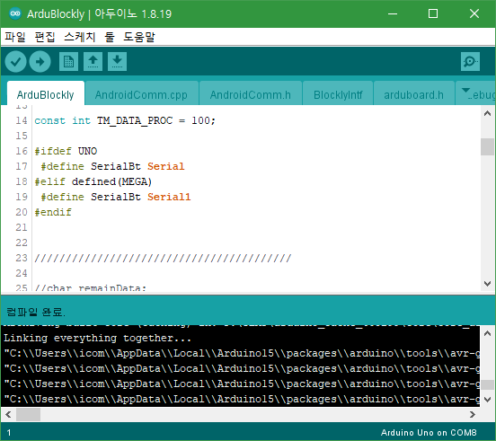
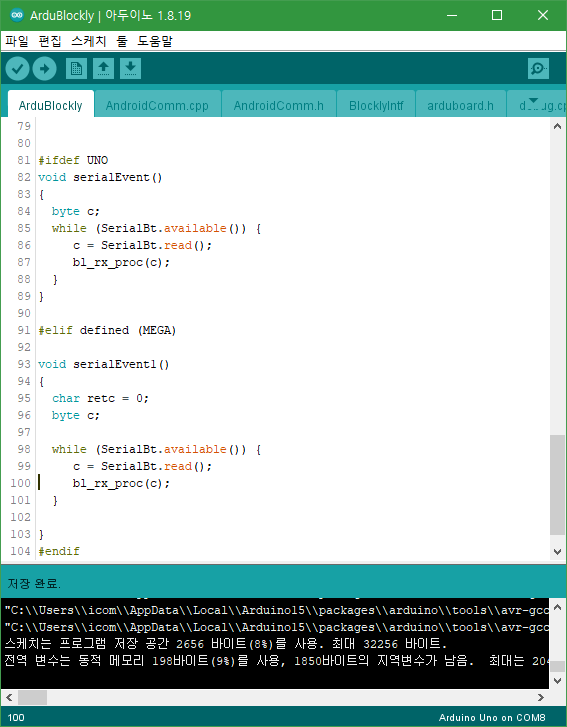
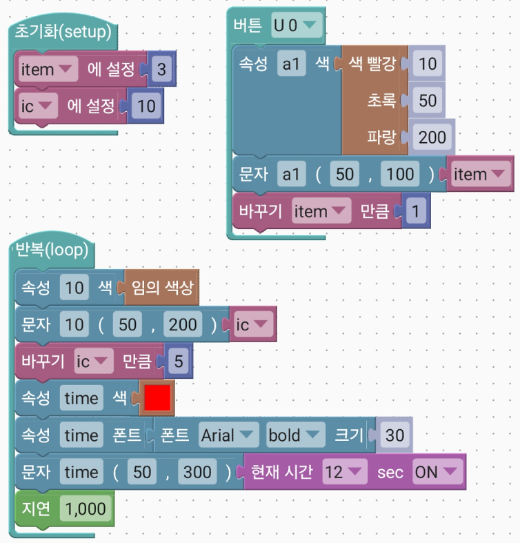
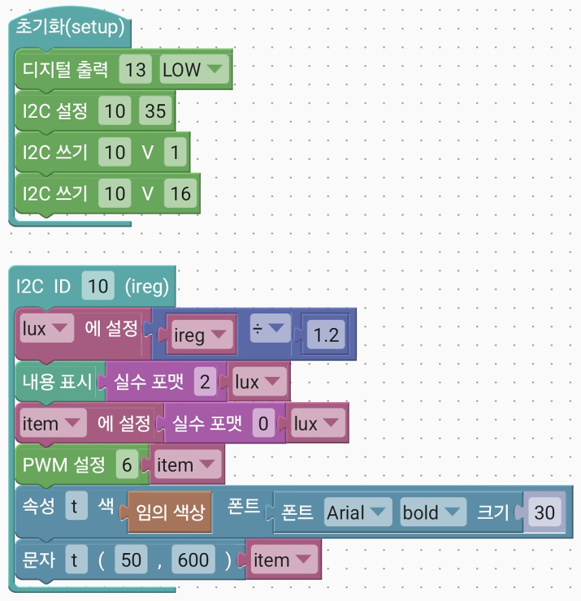
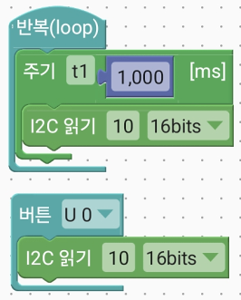
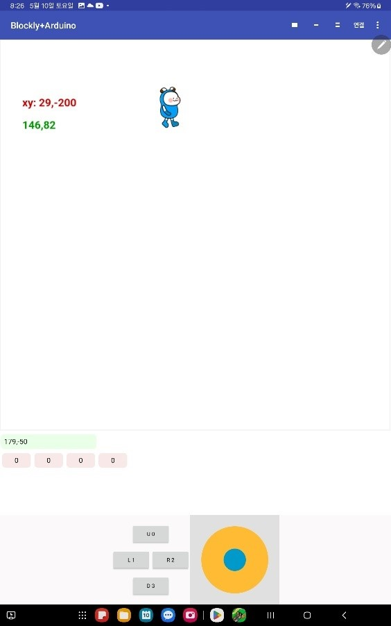
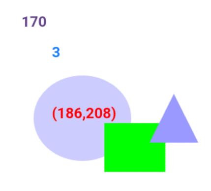
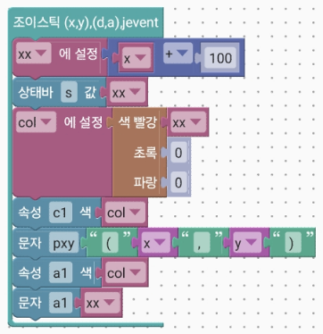
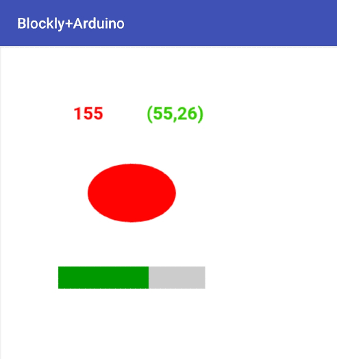

# 참고 이미지

폴더: images - 설명서에서 사용한 이미지, 기타 참고 이미지

앱 실행 구조

 &nbsp; 

앱 설치 실행화면

&nbsp;&nbsp;

아두이노

&nbsp;&nbsp;

&nbsp;

회로

 &nbsp; 

블록코드 예

 &nbsp; 

 &nbsp; &nbsp;

&nbsp;

&nbsp;

&nbsp;

&nbsp;

&nbsp;&nbsp;&nbsp;
&nbsp;

