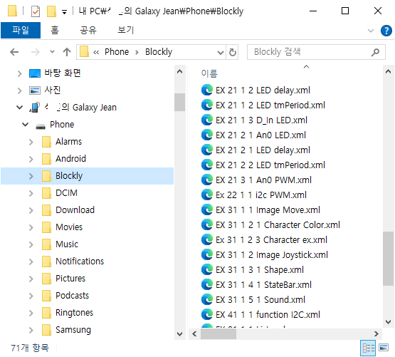

# 블록 코드 예제

* 폴더:  xml

documents 폴더에 있는 설명서 'Blockly+Arduino 블럭 코드 사용설명서.pdf'의 예제 블록 코드이다.
사용법은 이 문서의 설명을 참조하면 된다.

## 사용 방법

파일형은 xml으로 외부저장소에 복사하고 앱에서 읽으면 미리 작성된 블록코드를 볼 수 있다.
documents안의 설명서 참고 하면된다.

안드로이드 API30 이상에서는 'Download' 폴더의 액세스가 제한된다. 
따라서 내가 원하는 폴더를 만들고 윈도우에서 예제 코드를 스마트폰에 복사하여 사용한다.

안드로이드 폰을 연결하고 윈도우 탐색기에 보인다. 내가 원하는 폴더를 만들고 여기에 복사하면 된다. 예에서 'Blockly'폴더를 생성하고 복사한 예이다. 

앱의 메뉴 '외부 저장소'는 사용자가 작성하거나 다른 사용자가 만들어진 블록코드 파일을 읽어 사용하는데 유용하다.

