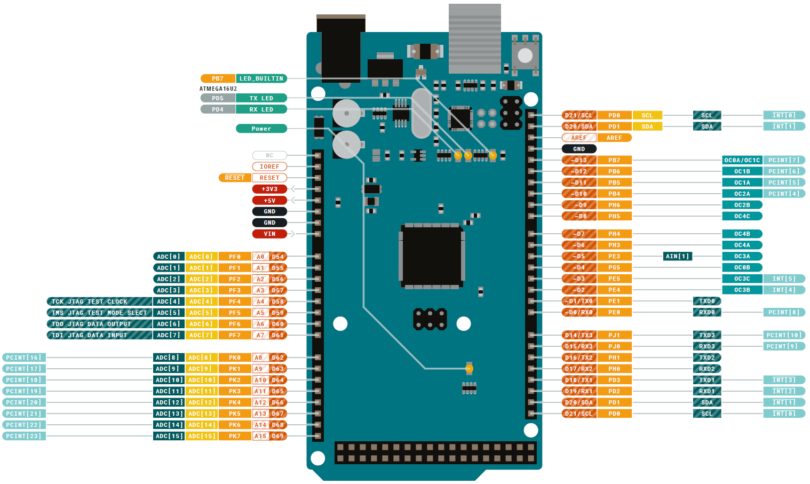

# Arduino 

## Arduino UNO

### 부품 설명 문서

아두이노 UNO의 핵심 부품인 MCU는 ATmega328x AVR8 계열이다. 

- ATmega328P_Datasheet.pdf

- Digital: D0~D14
    디지털 입출력의 경우 15핀 중에 특수한 핀의 사용은 제한된다.
    D0,D1: 시리얼 통신으로 USB로 연결되는 통신용이므로 디지털 포트로 사용할 수 없다.
- 아날로그 입력: A0~A5까지 6개의 핀이 할당되어 있다. I2C를 사용하면 2개의 입력은 불가능하다.
MCU 내부에 ADC 하드웨어 회로는 한 개 이고, 10비트 ADC이다. 6개의 아날로그 신호를 아날로그 ADMUX을 이용하여 한 개를 선택하여 ADC한다. 따라서 동시에 변환은 불가능하다.  
- PWM: D2 ~ D13 중에 ~표시 있는 것만 사용할 수 있다. PWM은 MCU의 ‘Timer’하드웨어 회로에 의해 PWM 신호가 발생한다.
- I2C: A4(D18, SDA), A5(D19, SCLK) 핀은 I2C 하드웨어 회로와 연결되어 있어, I2C을 기능을 사용하면 디지털, 아날로그 입력이 불가능하다.
- 시리얼 통신(UART): 1개의 시리얼 통신 하드웨어 모듈이 장착되어 있고, USB 통한 PC와 연결된다. 다른 목적이 불가능하다. USB와 연결되어 MCU실행 코드 업로드가 이 채널에 의해 이루어 진다. 실행 과정에서는 UART 통신을 담당한다. 시리얼 통신 모듈이 부족하므로 더 필요하면 SoftwareSerial 클래스러 소프트웨어 방식으로 구현되다. 따라서 CPU로드가 걸리고 속도 BAUD의 제한이 있다. 고속 통신에 한계가 있어 고속 통신이 필요한 경우 고민을 해야한다.

### 회로도 및 Pin Map

## Arduino MEGA 2560

### 부품 설명 문서

- Atmega640-1280-1281-2560-2561_datasheet.pdf

- Digital: D0~D69
  디지털 입출력의 경우 70핀 중에 특수한 핀의 사용은 제한된다.
  D0,D1: 시리얼 통신으로 USB로 연결되는 통신용이므로 디지털 포트로 사용할 수 없다.
- 아날로그 입력: A0~A15까지 16개의 핀이 할당되어 있다.
   MCU 내부에 ADC 하드웨어 회로는 한 개 이고, 10비트 ADC이다. 16개의 아날로그 신호를 아날로그 ADMUX을 이용하여 한 개를 선택하여 ADC한다. 따라서 동시에 변환은 불가능하다.  
- PWM: D2~D13, D44~46 핀으로 15개로 ~표시 있는 것만 사용할 수 있다. PWM은 MCU의 ‘Timer’하드웨어 회로에 의해 PWM 신호가 발생한다.
- I2C: D20(SDA), D21(SCLK) 핀은 I2C 하드웨어 회로와 연결되어 있어, I2C을 기능을 사용하면 디지털 입출력이 불가능하다.
- 시리얼 통신(UART): 4개의 시리얼 통신 하드웨어 모듈이 장착되어 있고, 첫번째 시리얼은 USB 통한 PC와 연결된다. 다른 목적이 불가능하다.

### Pin Map

