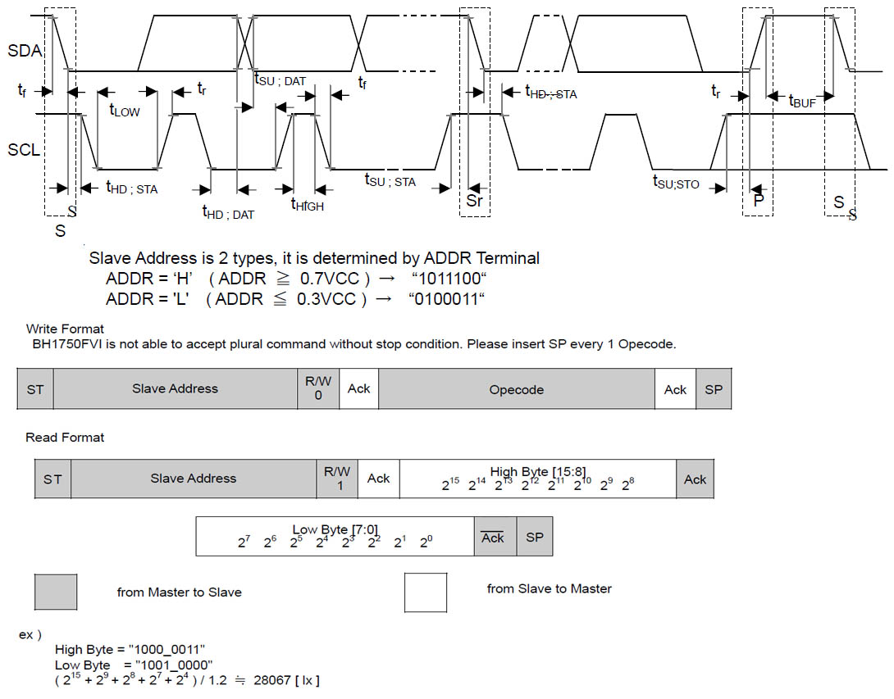
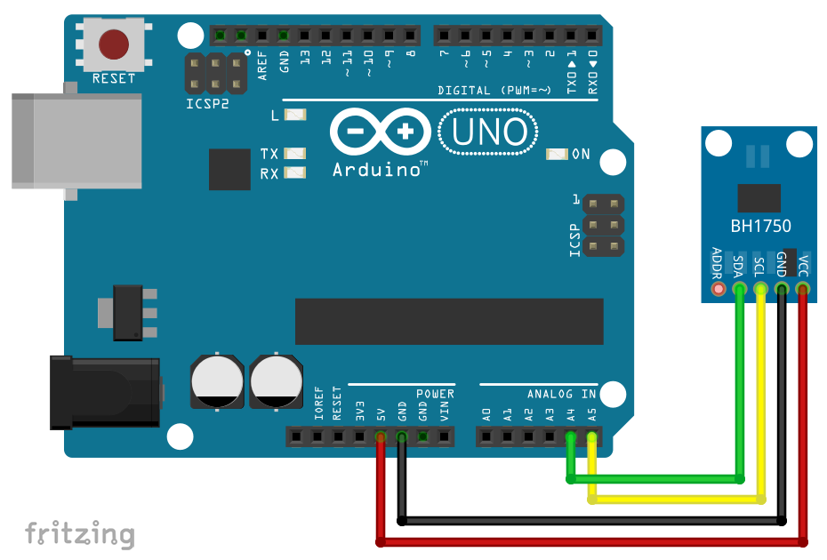

# BH1750FVI

- BH1750FVI_LightSendsor_I2C_ROHMS34826.pdf

조도센서로 I2C 시리얼 통신으로 MCU와 인터페이스 지원한다.

## I2C 인터페이스

## BH1750FVI 아두이노 라이브러리

- PeterEmbedded: https://github.com/PeterEmbedded/BH1750FVI

- RobTillaart:  https://github.com/RobTillaart/BH1750FVI_RT

### BH1750

- claws: https://github.com/claws/BH1750

## 참고 블로그 

BH1750FVI (GY-30, 302) ambient light sensor

https://wolles-elektronikkiste.de/en/bh1750fvi-gy-30-302-ambient-light-sensor

